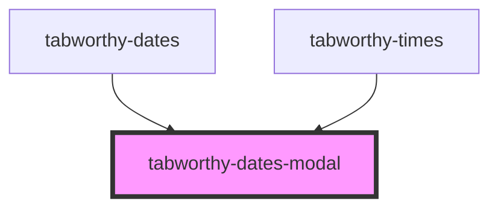

# tabworthy-dates-modal

<!-- Auto Generated Below -->

## Properties

| Property             | Attribute   | Description                                                                                                                                                                                    | Type                                                                                                                                                                                                         | Default          |
| -------------------- | ----------- | ---------------------------------------------------------------------------------------------------------------------------------------------------------------------------------------------- | ------------------------------------------------------------------------------------------------------------------------------------------------------------------------------------------------------------ | ---------------- |
| `appendTo`           | `append-to` | Element to append the dropdown to. Use "body" to append to document.body, or pass a CSS selector or HTMLElement. When set, the dropdown will be portaled to escape overflow:hidden containers. | `HTMLElement \| string`                                                                                                                                                                                      | `undefined`      |
| `inline`             | `inline`    |                                                                                                                                                                                                | `boolean`                                                                                                                                                                                                    | `false`          |
| `label` _(required)_ | `label`     |                                                                                                                                                                                                | `string`                                                                                                                                                                                                     | `undefined`      |
| `offset`             | --          | Offset from the trigger element [skidding, distance]                                                                                                                                           | `[number, number]`                                                                                                                                                                                           | `[0, 8]`         |
| `placement`          | `placement` | Preferred placement of the dropdown (Popper.js placement)                                                                                                                                      | `"auto" \| "auto-end" \| "auto-start" \| "bottom" \| "bottom-end" \| "bottom-start" \| "left" \| "left-end" \| "left-start" \| "right" \| "right-end" \| "right-start" \| "top" \| "top-end" \| "top-start"` | `"bottom-start"` |

## Events

| Event    | Description | Type               |
| -------- | ----------- | ------------------ |
| `closed` |             | `CustomEvent<any>` |
| `opened` |             | `CustomEvent<any>` |

## Methods

### `close() => Promise<void>`

Close the dialog.

#### Returns

Type: `Promise<void>`

### `getState() => Promise<boolean>`

#### Returns

Type: `Promise<boolean>`

### `open() => Promise<void>`

Open the dialog.

#### Returns

Type: `Promise<void>`

### `setTriggerElement(element: HTMLElement) => Promise<void>`

#### Parameters

| Name      | Type          | Description |
| --------- | ------------- | ----------- |
| `element` | `HTMLElement` |             |

#### Returns

Type: `Promise<void>`

### `updatePosition() => Promise<void>`

Force update the popper position

#### Returns

Type: `Promise<void>`

## Slots

| Slot     | Description        |
| -------- | ------------------ |
| `"slot"` | The dialog content |

## Shadow Parts

| Part        | Description |
| ----------- | ----------- |
| `"body"`    |             |
| `"content"` |             |

## Dependencies

### Used by

- [tabworthy-dates](../tabworthy-dates)
- [tabworthy-times](../tabworthy-times)

### Graph

---

_Built with [StencilJS](https://stenciljs.com/)_
