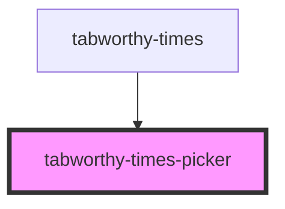

# tabworthy-times-picker

<!-- Auto Generated Below -->

## Properties

| Property              | Attribute                | Description | Type                | Default                    |
| --------------------- | ------------------------ | ----------- | ------------------- | -------------------------- |
| `disabled`            | `disabled`               |             | `boolean`           | `false`                    |
| `elementClassName`    | `element-class-name`     |             | `string`            | `"tabworthy-times-picker"` |
| `hours`               | `hours`                  |             | `number`            | `12`                       |
| `labels`              | --                       |             | `TimesPickerLabels` | `defaultLabels`            |
| `labelsSrOnly`        | `labels-sr-only`         |             | `boolean`           | `true`                     |
| `maxTime`             | --                       |             | `TimeBounds`        | `undefined`                |
| `minTime`             | --                       |             | `TimeBounds`        | `undefined`                |
| `minutes`             | `minutes`                |             | `number`            | `0`                        |
| `modalIsOpen`         | `modal-is-open`          |             | `boolean`           | `false`                    |
| `seconds`             | `seconds`                |             | `number`            | `0`                        |
| `showSeconds`         | `show-seconds`           |             | `boolean`           | `false`                    |
| `useTwelveHourFormat` | `use-twelve-hour-format` |             | `boolean`           | `false`                    |

## Events

| Event         | Description | Type                     |
| ------------- | ----------- | ------------------------ |
| `timeChanged` |             | `CustomEvent<TimeValue>` |

## Dependencies

### Used by

 - [tabworthy-times](../tabworthy-times)

### Graph

----------------------------------------------

*Built with [StencilJS](https://stenciljs.com/)*
