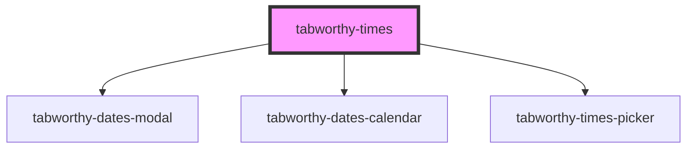

# tabworthy-times

<!-- Auto Generated Below -->

## Properties

| Property                | Attribute                 | Description                                                                                                                                                      | Type                                                                                                                                                                                                                                                                                                                                | Default                            |
| ----------------------- | ------------------------- | ---------------------------------------------------------------------------------------------------------------------------------------------------------------- | ----------------------------------------------------------------------------------------------------------------------------------------------------------------------------------------------------------------------------------------------------------------------------------------------------------------------------------- | ---------------------------------- |
| `appendTo`              | `append-to`               | Element to append the dropdown to. Use "body" to append to document.body, or pass a CSS selector or HTMLElement. Useful for escaping overflow:hidden containers. | `HTMLElement \| string`                                                                                                                                                                                                                                                                                                             | `undefined`                        |
| `calendarButtonContent` | `calendar-button-content` |                                                                                                                                                                  | `string`                                                                                                                                                                                                                                                                                                                            | `undefined`                        |
| `datesCalendarLabels`   | --                        |                                                                                                                                                                  | `{ clearButton: string; closeButton: string; monthSelect: string; nextMonthButton: string; nextYearButton: string; picker: string; previousMonthButton: string; previousYearButton: string; todayButton: string; yearSelect: string; keyboardHint: string; selected: string; chooseAsStartDate: string; chooseAsEndDate: string; }` | `undefined`                        |
| `disableDate`           | --                        |                                                                                                                                                                  | `(date: Date) => boolean`                                                                                                                                                                                                                                                                                                           | `() => false`                      |
| `disableFreeformInput`  | `disable-freeform-input`  |                                                                                                                                                                  | `boolean`                                                                                                                                                                                                                                                                                                                           | `false`                            |
| `disabled`              | `disabled`                |                                                                                                                                                                  | `boolean`                                                                                                                                                                                                                                                                                                                           | `false`                            |
| `elementClassName`      | `element-class-name`      |                                                                                                                                                                  | `string`                                                                                                                                                                                                                                                                                                                            | `"tabworthy-times"`                |
| `firstDayOfWeek`        | `first-day-of-week`       |                                                                                                                                                                  | `number`                                                                                                                                                                                                                                                                                                                            | `1`                                |
| `format`                | `format`                  |                                                                                                                                                                  | `string`                                                                                                                                                                                                                                                                                                                            | `"YYYY-MM-DDTHH:mm:ss"`            |
| `hasError`              | `has-error`               |                                                                                                                                                                  | `boolean`                                                                                                                                                                                                                                                                                                                           | `false`                            |
| `id` _(required)_       | `id`                      |                                                                                                                                                                  | `string`                                                                                                                                                                                                                                                                                                                            | `undefined`                        |
| `inline`                | `inline`                  |                                                                                                                                                                  | `boolean`                                                                                                                                                                                                                                                                                                                           | `false`                            |
| `inputClass`            | `input-class`             |                                                                                                                                                                  | `string`                                                                                                                                                                                                                                                                                                                            | `""`                               |
| `inputShouldFormat`     | `input-should-format`     |                                                                                                                                                                  | `boolean \| string`                                                                                                                                                                                                                                                                                                                 | `true`                             |
| `label`                 | `label`                   |                                                                                                                                                                  | `string`                                                                                                                                                                                                                                                                                                                            | `"Choose a date and time"`         |
| `locale`                | `locale`                  |                                                                                                                                                                  | `string`                                                                                                                                                                                                                                                                                                                            | `navigator?.language \|\| "en-US"` |
| `maxDate`               | `max-date`                |                                                                                                                                                                  | `string`                                                                                                                                                                                                                                                                                                                            | `undefined`                        |
| `minDate`               | `min-date`                |                                                                                                                                                                  | `string`                                                                                                                                                                                                                                                                                                                            | `undefined`                        |
| `placeholder`           | `placeholder`             |                                                                                                                                                                  | `string`                                                                                                                                                                                                                                                                                                                            | `""`                               |
| `range`                 | `range`                   |                                                                                                                                                                  | `boolean`                                                                                                                                                                                                                                                                                                                           | `false`                            |
| `referenceDate`         | `reference-date`          |                                                                                                                                                                  | `string`                                                                                                                                                                                                                                                                                                                            | `getISODateString(new Date())`     |
| `showClearButton`       | `show-clear-button`       |                                                                                                                                                                  | `boolean`                                                                                                                                                                                                                                                                                                                           | `true`                             |
| `showCloseButton`       | `show-close-button`       |                                                                                                                                                                  | `boolean`                                                                                                                                                                                                                                                                                                                           | `false`                            |
| `showMonthStepper`      | `show-month-stepper`      |                                                                                                                                                                  | `boolean`                                                                                                                                                                                                                                                                                                                           | `true`                             |
| `showSeconds`           | `show-seconds`            |                                                                                                                                                                  | `boolean`                                                                                                                                                                                                                                                                                                                           | `false`                            |
| `showTodayButton`       | `show-today-button`       |                                                                                                                                                                  | `boolean`                                                                                                                                                                                                                                                                                                                           | `true`                             |
| `showYearStepper`       | `show-year-stepper`       |                                                                                                                                                                  | `boolean`                                                                                                                                                                                                                                                                                                                           | `false`                            |
| `startDate`             | `start-date`              |                                                                                                                                                                  | `string`                                                                                                                                                                                                                                                                                                                            | `getISODateString(new Date())`     |
| `timesLabels`           | --                        |                                                                                                                                                                  | `TimesLabels`                                                                                                                                                                                                                                                                                                                       | `defaultLabels`                    |
| `timesPickerLabels`     | --                        |                                                                                                                                                                  | `TimesPickerLabels`                                                                                                                                                                                                                                                                                                                 | `undefined`                        |
| `useTwelveHourFormat`   | `use-twelve-hour-format`  |                                                                                                                                                                  | `boolean`                                                                                                                                                                                                                                                                                                                           | `true`                             |
| `value`                 | `value`                   |                                                                                                                                                                  | `string \| string[]`                                                                                                                                                                                                                                                                                                                | `undefined`                        |

## Events

| Event            | Description | Type                                   |
| ---------------- | ----------- | -------------------------------------- |
| `changeYear`     |             | `CustomEvent<YearChangedEventDetails>` |
| `componentReady` |             | `CustomEvent<void>`                    |
| `selectDateTime` |             | `CustomEvent<string \| string[]>`      |

## Methods

### `clearValue() => Promise<void>`

#### Returns

Type: `Promise<void>`

## Dependencies

### Depends on

- [tabworthy-dates-modal](../tabworthy-modal)
- [tabworthy-dates-calendar](../tabworthy-dates-calendar)
- [tabworthy-times-picker](../tabworthy-times-picker)

### Graph

---

_Built with [StencilJS](https://stenciljs.com/)_
